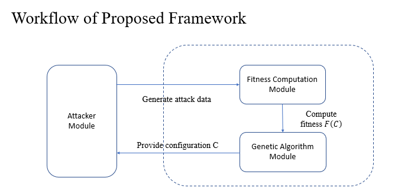

# Adaptive Vulnerability Configurations Framework (AVCF)

## 📌 Overview
This project implements the **Adaptive Vulnerability Configurations Framework (AVCF)**,  
a system designed to optimize Active Directory (AD) honeypot configurations using **Genetic Algorithms (GA)**.  

Traditional honeypots often rely on static configurations, which may fail to attract adversaries once their interests shift.  
AVCF addresses this by dynamically adjusting vulnerability combinations to maximize **attacker engagement depth** and **diversity of adversarial behavior**.



## 🔧 Features
 **Genetic Algorithm Optimization**
  - Implements traditional GA and enhanced versions with **Bias-Guided Mutation** and **Exponential Moving Average (EMA)** smoothing.
 **Attacker Module**
  - Simulates attacker behaviors based on preference profiles to evaluate vulnerability attractiveness.
 **Fitness Computation**
  - Calculates a weighted score using **attack depth** and **number of attacker IPs**.
 **Baseline Comparison**
  - Includes Random Sampling and Traditional GA for performance benchmarking.
 **Visualization Tools**
  - Provides convergence plots and statistical analysis of experiment results.

## 🏗️ Project Structure

## 📁 AD_GA_Project

 **compute_fitness.py** — Fitness function module  
 **simulate_attack.py** — Attacker module simulation  
 **ga_main.py** — Main GA implementation  
 **trandition_ga_main.py** — Traditional GA baseline  
 **ga_ema_only.py** — GA with EMA enhancement  
 **random_sampling.py** — Random baseline  
 **fitness_logger.py** — Fitness logging utility  
 **plot_fitness.py** — Convergence visualization  

### 📁 data
 **attacker_profiles.json** — Attacker preference profiles  
 **tech_score_table.json** — MITRE ATT&CK technique scoring  
 **vuln_to_tech.json** — Vulnerability-to-technique mapping  

### 📁 output
 **fitness_history.csv** — GA run history  
 **fitness_plot.png** — Convergence plots  
 **compare_vs.png** — Comparative results  

### 📄 README.md

## 🚀 Usage

  **1. Clone Repository**
  ```bash
    git clone https://github.com/s51190538196/AD_GA_Project.git
    cd AD_GA_Project
  ```

  **2. Run Genetic Algorithm**
  ```bash
  python ga_main.py
  ```

  **3. Visualize Results**
  ```bash
  python plot_fitness.py
  ```
  Results will be saved in the /output directory.

## 📊 Example Results
  - GA vs Random Sampling
    
  - Bias-Guided GA vs Traditional GA
